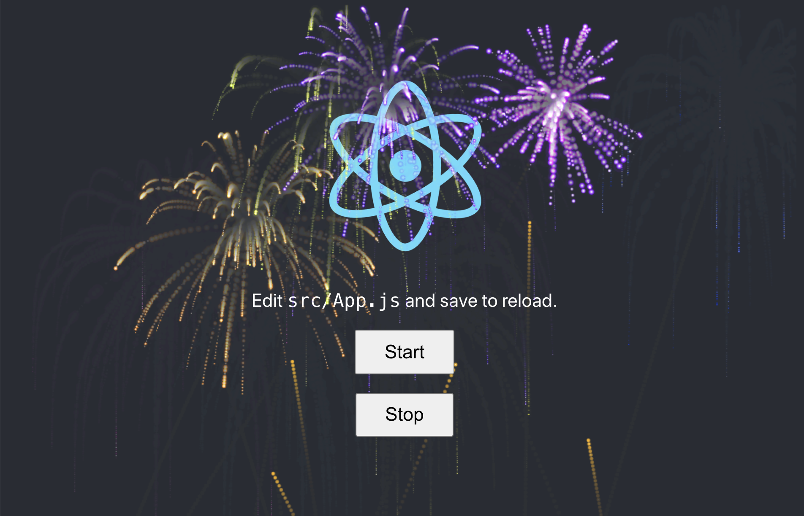

# React版烟花特效

很喜欢这个特效，所以做了个React重置版本。

原作者JQuery版本链接:
https://github.com/mgrigajtis/jquery-fireworks

原版演示：
https://www.jq22.com/jquery-info11031

## 示例构建

确保环境已安装Git/Node.js/npm，然后运行：

```shell
$ git clone https://github.com/winters-song/react-fireworks.git
$ cd react-fireworks
$ npm install
```

在浏览器里预览效果：

```shell
$ yarn start
```

---

# React Fireworks (jQuery-fireworks remake)
Original JQuery version:
https://github.com/mgrigajtis/jquery-fireworks

# install

```shell
$ git clone https://github.com/winters-song/react-fireworks.git
$ cd react-fireworks
$ npm install
```

# preview

```shell
$ yarn start
```
